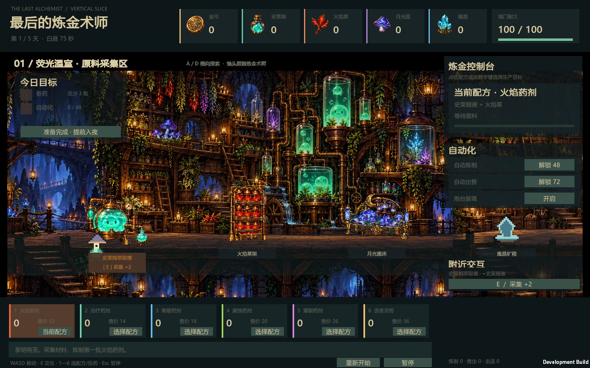
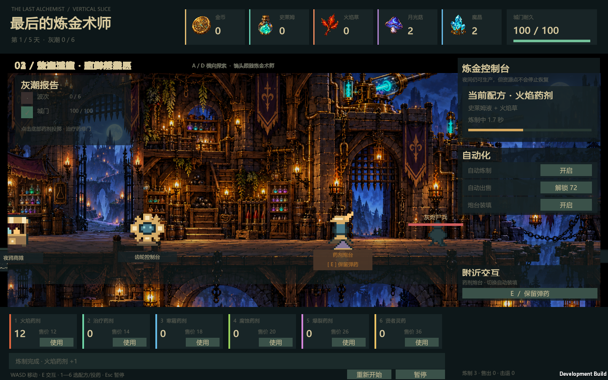

# The Last Alchemist / 最后的炼金术师

> A 2D alchemy, automation, management, and roguelike vertical slice built with Unity.<br>
> 使用 Unity 制作的 2D 炼金、自动化经营与 Roguelike 可玩垂直切片。



## Overview / 项目简介

《最后的炼金术师》围绕一条容易让人“再玩十分钟”的生产循环展开：探索横向大地图、采集炼金材料、选择配方炼制药剂、出售成品或保留弹药抵御夜袭，再用收益升级设备并逐步解锁自动生产。

```text
采集材料 → 炼金合成 → 制作药剂 → 出售 / 战斗
    ↑                                  ↓
    └──── 升级设备 ← 解锁自动生产 ────┘
```

当前版本是一套完整的五日可玩流程：白天经营生产，夜晚守卫城门，每次幸存后从三个炼金洞见中选择一项，最终迎战灰潮之王。

## Highlights / 核心特色

- 连续横向大地图：荧光温室、炼金工坊、灰潮城门三个区域，摄像机平滑跟随角色。
- 四类材料：史莱姆液、火焰草、月光菇、魔晶，各自拥有独立资源点与恢复时间。
- 六种药剂：火焰、治疗、寒霜、腐蚀、爆裂与贤者灵药。
- 自动化生产：自动炼制、自动出售与药剂炮台装填均可解锁和切换。
- 经营与战斗互相影响：出售药剂能换取升级资金，保留药剂则能强化夜间防御。
- Roguelike 成长：15 项炼金洞见、随机日间事件、五日递进难度和最终 Boss。
- 独立美术交互点：史莱姆萃取槽、三层火焰草架、弯月月光菌床及对应采集反馈。
- 版本化本地存档：定时保存、原子替换、备份恢复与损坏存档保护。

## Gameplay / 游戏画面

| 荧光温室与采集区 | 灰潮城门与夜间防御 |
| --- | --- |
|  |  |

## Controls / 操作

| Input | Action |
| --- | --- |
| `WASD` / 方向键 | 在横向地图中移动 |
| `E` | 与附近资源点或设备交互 |
| `1`—`6` | 白天选择配方；夜间使用对应药剂 |
| `Esc` | 暂停或继续 |
| 鼠标 | 操作配方、自动化、交互和药剂按钮 |

## Requirements / 环境要求

- Unity `6000.6.0f1`
- Windows 10/11（当前构建目标为 Windows x64）
- Unity Input System、URP 与项目 `Packages/manifest.json` 中列出的依赖

## Getting Started / 运行项目

1. 克隆仓库：

   ```bash
   git clone https://github.com/Cyrene-06/The-last-alchemist.git
   ```

2. 使用 Unity Hub 添加并打开仓库根目录。
3. 打开场景 `Assets/LastAlchemist/Scenes/AlchemyPrototype.unity`。
4. 点击 Play，或通过菜单 **炼金原型 → 打开垂直切片**。

推荐将 Game 视图设为 `1440 × 900`。更小的窗口会保持比例并自动留出黑边。

## Build / 构建

在 Unity 菜单选择 **炼金原型 → 构建 Windows 可玩版**。构建流程会先执行核心逻辑检查，然后将 Windows Development Build 输出到：

```text
Builds/LastAlchemist/LastAlchemist.exe
```

构建产物、Unity `Library`、日志和本地验证结果均由 `.gitignore` 排除；仓库保存的是可复现构建所需的完整 Unity 源项目。

## Validation / 验证

- 45 项确定性核心逻辑检查，覆盖全部配方、经济、自动化、完整夜袭、洞见、事件、存档恢复和帧率独立性。
- Development Build 烟雾测试会自动完成移动、四种采集、炼制、自动化、夜战、洞见选择与多分辨率截图检查。
- 可在独立版本中追加以下参数运行烟雾测试：

  ```text
  --alchemy-smoke-test -screen-width 1440 -screen-height 900 -screen-fullscreen 0
  ```

## Save Data / 存档

存档写入 Unity 的 `Application.persistentDataPath/last-alchemist-v3.json`。系统会在交互、阶段切换、失去焦点、退出以及每五秒自动保存，并保留 `.bak` 备份。

## Project Structure / 项目结构

```text
Assets/LastAlchemist/
├─ Editor/                 # 编辑器菜单、核心检查与 Windows 构建入口
├─ Resources/Art/          # 地图、资源图标及透明交互设备资产
├─ Scenes/                 # 可玩垂直切片场景
└─ Scripts/
   ├─ AlchemyState.cs      # 生产、经济、昼夜、战斗与 Roguelike 模拟
   ├─ AlchemySave.cs       # JSON 存档、原子写入与备份恢复
   ├─ AlchemyPrototype.cs  # 场景装配、输入、交互、镜头、动画与界面
   ├─ PixelWorkshop.cs     # 运行时精灵和三段式地图装配
   └─ AlchemySmokeTest.cs  # 端到端自动操作与截图验证
```

## Current Scope / 当前定位

这是验证核心玩法循环的首个垂直切片。下一阶段适合将运行时对象拆为 Prefab，把配方与洞见迁移到 ScriptableObject，并将 IMGUI 界面迁移到 UI Toolkit 或 UGUI。

## Contributors / 共同创作

- [Cyrene-06](https://github.com/Cyrene-06) — project owner, concept, direction, and design
- **OpenAI Codex** — implementation, art integration, testing, and documentation collaborator
